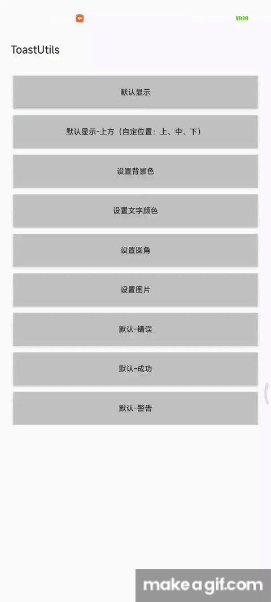

[](https://jitpack.io/#JetQiao/ToastUtils)

# 简易Toast
轻量级的Android toast。
可以实现顶部、底部、中间弹出；
支持文字颜色、背景颜色、字体大小的设置；
提供简洁的APi调用。
默认提供成功、失败、警告、等样式。

# Demo预览
<div>
    
</div>

# 使用方法

```groovy
repositories {
    maven { url 'https://jitpack.io' }
}
```

## 引入依赖
```groovy
dependencies {
    implementation 'com.github.JetQiao:ToastUtils:1.0.0'
}
```


## 简单调用
```Kotlin
ToastView(context).setMessage("show toast").show()

ToastView(context).setMessage("show toast").setGravity(Gravity.BOTTOM).show()

ToastView(context).setMessage("show toast").setBackground("#FFB225").show()

ToastView(context).showSuccess("成功信息")
```